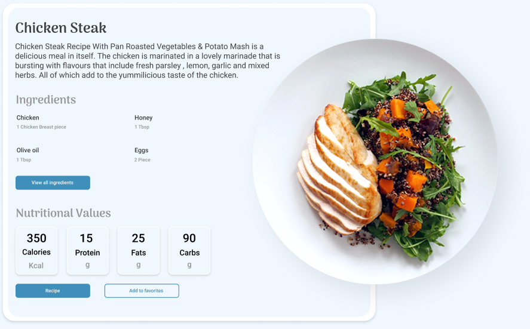

# Recipe Planet Applikation (del 2)

I denne anden del af Recipe Planet skal du lave selve applikationen.

Applikationen er en præsentation af opskrifter som kommer fra APIet (se del 1).

Applikationen er tiltænkt tablets.

[Designet finder du her](./RecipePlanet.fig).

## Beskrivelse
Recipe Planet applikationen er en opskriftpræsentation, som lader brugere vælge mellem forskellige kategorier af opskrifter.

Dette kan fx være
* Chicken
* Fruits
* Chinese
* Mexican

Brugere kan også vælge mellem forskellige typer, fx
* Dinner
* Lunch
* Breakfast
* Snacks

Disse typer og kategorier er tænkt som sorterings eller filtreringsmuligheder for brugeren.

Dette betyder, at hvis en bruger vælger Mexican øverst og Dinner i venstre side så får brugeren vist alle oskrifter som matcher de kriterier.

Opskrifterne præsenteres som en slider, hvor brugeren kan "swipe" mellem opskrifterne. Hvis en bruger klikker på "View all ingredients" på en opskrift, vises en liste over ingredienser i et modal vindue. Du skal selv bestemme hvordan dette modal vindue skal se ud, men det skal følge det øvrige design.

Det samme gør sig gældende for knappen "Recipe".

"Add to favourites"-knappen skal du ignorere.